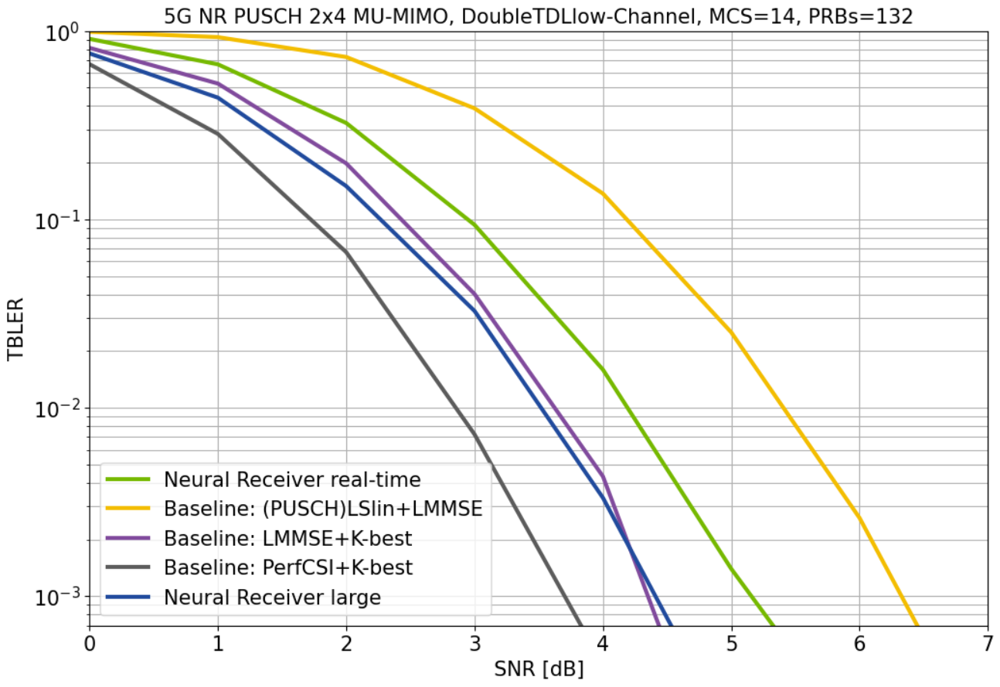

<!-- SPDX-FileCopyrightText: Copyright (c) 2024 NVIDIA CORPORATION & AFFILIATES. All rights reserved.
SPDX-License-Identifier: LicenseRef-NvidiaProprietary

NVIDIA CORPORATION, its affiliates and licensors retain all intellectual
property and proprietary rights in and to this material, related
documentation and any modifications thereto. Any use, reproduction,
disclosure or distribution of this material and related documentation
without an express license agreement from NVIDIA CORPORATION or
its affiliates is strictly prohibited. -->

# Real-Time Inference of 5G NR Multi-user MIMO Neural Receivers

The code in this repository allows to design, train, and evaluate [neural
receivers](https://developer.nvidia.com/blog/towards-environment-specific-base-stations-ai-ml-driven-neural-5g-nr-multi-user-mimo-receiver/)
using the [NVIDIA® Sionna™ link-level simulation
library](https://nvlabs.github.io/sionna/) and TensorFlow. Further, trained
receivers can be prepared for real-time inference via [NVIDIA®
TensorRT™](https://developer.nvidia.com/tensorrt).

[<p align="center"></p>](notebooks/jumpstart_tutorial.ipynb)

The following features are currently supported:

- 5G NR compliant Multi-user MIMO PUSCH receiver
- Training pipeline using 3GPP compliant channel models
- TensorRT / ONNX model export for real-time inference
- Support for varying number of PRBs, users, and different MCS schemes per user
- End-to-end learning of custom constellations for [pilotless communications](https://arxiv.org/pdf/2009.05261) [3]
- Site-specific training using ray-tracing based channel simulations from [SionnaRT](https://nvlabs.github.io/sionna/api/rt.html) as done in [2]

We recommend starting with the [Jumpstart NRX Tutorial notebook](notebooks/jumpstart_tutorial.ipynb) for a detailed introduction and overview of the project.

The basic neural receiver architecture is introduced and described in [a Neural Receiver for 5G NR Multi-user MIMO](https://arxiv.org/pdf/2312.02601) [1].
The real-time experiments and the site-specific training is described in [Design of a Standard-Compliant Real-Time
Neural Receiver for 5G NR](TODO) [2].

Demos of this receiver architecture have been shown at [Mobile World Congress 2023](https://www.youtube.com/watch?v=BQyxBYzdg5k) and [Mobile World Congress 2024](https://www.keysight.com/us/en/assets/3124-1306/demos/6G-AI-Neural-Receiver-Design.mp4).

For further details regarding solutions for deployment in an actual Radio Access Network (RAN), we recommend registering for the [NVIDIA 6G Developer Program](https://developer.nvidia.com/6g-program).

[<p align="center"></p>](notebooks/jumpstart_tutorial.ipynb)

## Summary

We introduce a neural network (NN)-based multi-user multiple-input
multiple-output (MU-MIMO) receiver with full 5G New Radio (5G NR) physical
uplink shared channel (PUSCH) compatibility based on graph and convolutional
neural network (CGNN) components. The proposed architecture can be easily
re-parametrized to an arbitrary number of sub-carriers and supports a varying
number of users without the need for any additional re-training. The receiver
operates on an entire 5G NR slot, i.e., it processes the entire received
orthogonal frequency division multiplexing (OFDM) time-frequency resource grid
by jointly performing channel estimation, equalization, and demapping. We show
the importance of a carefully designed training process such that the trained
receiver does not overfit to a specific channel realization and remains
universal for a wide range of different unseen channel conditions. A particular
focus of the architecture design is put on the real-time inference capability
such that the receiver can be executed within 1 ms latency on an NVIDIA A100
GPU.

[<p align="center"></p>](notebooks/real_time_nrx.ipynb)

## Setup

Running this code requires [Sionna 0.18](https://nvlabs.github.io/sionna/).
To run the notebooks on your machine, you also need [Jupyter](https://jupyter.org).
We recommend Ubuntu 22.04, Python 3.10, and TensorFlow 2.15.

For [TensorRT](https://developer.nvidia.com/tensorrt), we recommend version 9.6 and newer.
For [ONNX](https://onnx.ai/) exporting, the Python package `onnx==1.14` is required (`onnx==1.15` does not work due to a known bug).

## Structure of this repository

This repository is structured in the following way:
- [config](config/) contains the system configurations for different experiments
- [notebooks](notebooks/) contains tutorials and code examples
- [scripts](scripts/) contains the scripts to train, evaluate and debug the NRX
- [utils](utils/) contains the NRX definition and all Python utilities
- [weights](weights/) contains weights of pre-trained neural receivers for different configuration files
- [results](results/) contains pre-computed BLER performance results

The following two folders will be generated locally:
- `logs` contains log files of the training
- `onnx_models` contains exported ONNX neural receiver models
- `data` contains a ray tracing-based dataset of channel realizations for site-specific evaluation

We recommend starting with the [Jumpstart NRX Tutorial notebook](notebooks/jumpstart_tutorial.ipynb) for a detailed introduction and overview of the project.

## References

[1] S. Cammerer, F. Aït Aoudia, J. Hoydis, A. Oeldemann, A. Roessler, T. Mayer, and A. Keller, "[A Neural Receiver for 5G NR Multi-user MIMO](https://arxiv.org/pdf/2312.02601)", IEEE Workshops (GC Wkshps), Dec. 2023.

[2] R. Wiesmayr, S, Cammerer, F. Aït Aoudia, J. Hoydis, J. Zakrzewski, and Alexander Keller, "[Design of a Standard-Compliant Real-Time Neural Receiver for 5G NR](https://arxiv.org/abs/2409.02912)", arxiv preprint, 2024.

[3] F. Aït Aoudia and J. Hoydis, "[End-to-end Learning for OFDM: From Neural Receivers to Pilotless Communication](https://arxiv.org/pdf/2009.05261)", IEEE Trans on Wireless Commun., 2021.

## License

Copyright &copy; 2024, NVIDIA Corporation. All rights reserved.

This work is made available under the [NVIDIA License](LICENSE.txt).

# Citation

```
@software{neural_rx,
    title = {Real-time 5G NR Multi-user MIMO Receivers},
    author = {Sebastian Cammerer, Reinhard Wiesmayr, Fayçal Aït Aoudia, Jakob Hoydis, Tommi Koivisto, Jakub Zakrzewski, Ruqing Xu, Pawel Morkisz, Chris Dick, and Alexander Keller},
    note = {https://github.com/NVlabs/neural-rx},
    year = 2024
}
```

# Acknowledgement

This work has received financial support from the European Union under
Grant Agreement 101096379 (CENTRIC). Views and opinions expressed are
however those of the author(s) only and do not necessarily reflect those of the
European Union or the European Commission (granting authority). Neither the
European Union nor the granting authority can be held responsible for them.
